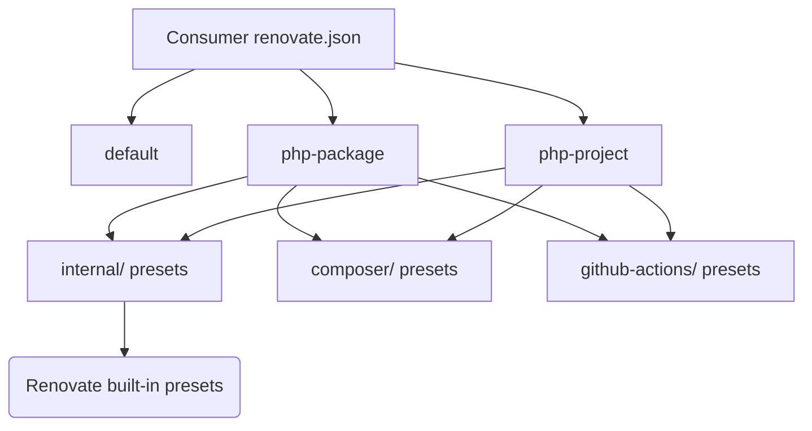

renovate-config
===============

Shared [Renovate](https://github.com/renovatebot/renovate) configuration for WyriHaximus repositories. Presets are
composed from reusable building blocks in `internal/`, `composer/`, and `github-actions/`.

Preset connection diagrams and catalog tables in this README are generated automatically from the JSON files when
running `make generate`.

Opinionated choices
-------------------

Base configuration
------------------

[`internal/base.json`](internal/base.json) sets the defaults used by all presets:

* `Europe/UTC` timezone
* OSV vulnerability alerts enabled
* GitHub Action digest pinning helpers
* Dependency labels from [`internal/labels.json`](internal/labels.json)
* Tool constraint updates for `php` and `composer` disabled via [`internal/do-not-update-tool-constraints.json`](internal/do-not-update-tool-constraints.json)
Package vs project throttling
-----------------------------

[`internal/package.json`](internal/package.json) removes PR limits for public packages (`:prHourlyLimitNone`,
`:prConcurrentLimitNone`). [`internal/project.json`](internal/project.json) limits projects to one PR per hour and
three concurrent PRs to reduce rebasing churn across many open PRs.
Composer range strategies
-------------------------

Public PHP packages use `widen` via [`composer/widen.json`](composer/widen.json). Projects and dev-oriented presets use
`bump` via [`composer/bump.json`](composer/bump.json). The `php-package-next` preset uses `in-range-only` for
next-version experimentation via [`composer/in-range.json`](composer/in-range.json).
PHP constraint pinning
----------------------

[`composer/do-not-update-php.json`](composer/do-not-update-php.json) prevents Renovate from bumping the `php`
constraint in `composer.json`.
Labels and grouping
-------------------

[`internal/labels.json`](internal/labels.json) adds dependency labels by update type. PHP presets add a `PHP 🐘` label.
GitHub Actions presets add a `CI 🚧` label and group Actions updates via [`github-actions/bump.json`](github-actions/bump.json).

Architecture
------------

Consumer repositories extend a top-level preset, which composes internal, composer, and GitHub Actions building blocks.
Those building blocks may in turn extend Renovate built-in presets such as `config:base` or `group:phpstan`.

Green edges in preset diagrams below show local preset references. Blue edges show Renovate built-in presets.

Top-level presets
-----------------

These presets are the documented entry points. Pick one and extend it from your repository's `renovate.json`.
| Preset | Usage |
|--------|-------|
| `default` | Alias for `php-package` |
| `php-package` | PHP packages on public repositories |
| `php-project` | PHP projects on private repositories with limited Actions credits |

Usage
-----

Preset connection diagrams are generated automatically from `extends` references when running `make generate`.
default
-------

Alias for the `php-package` preset.
```json
{
  "$schema": "https://docs.renovatebot.com/renovate-schema.json",
  "extends": [
    "github>WyriHaximus/renovate-config:default"
  ]
}
```
##### Preset connections



```mermaid
flowchart TB
  default_phpstan["composer/phpstan.json"] --> default_e0("group:phpstan")
  default_base["internal/base.json"] --> default_e1(":rebaseStalePrs")
  default_base["internal/base.json"] --> default_e2(":widenPeerDependencies")
  default_base["internal/base.json"] --> default_e3("config:base")
  default_base["internal/base.json"] --> default_e4("helpers:pinGitHubActionDigests")
  default_base["internal/base.json"] --> default_e5("helpers:pinGitHubActionDigestsToSemver")
  default_package["internal/package.json"] --> default_e6(":prConcurrentLimitNone")
  default_package["internal/package.json"] --> default_e7(":prHourlyLimitNone")
  default_default["default.json"] --> default_php_package["php-package.json"]
  default_base["internal/base.json"] --> default_do_not_update_tool_constraints["internal/do-not-update-tool-constraints.json"]
  default_base["internal/base.json"] --> default_labels["internal/labels.json"]
  default_github_actions["internal/github-actions.json"] --> default_bump["github-actions/bump.json"]
  default_package["internal/package.json"] --> default_base["internal/base.json"]
  default_php_base["internal/php-base.json"] --> default_do_not_update_php["composer/do-not-update-php.json"]
  default_php_base["internal/php-base.json"] --> default_mammatus["composer/mammatus.json"]
  default_php_base["internal/php-base.json"] --> default_phpstan["composer/phpstan.json"]
  default_php_base["internal/php-base.json"] --> default_phpunit["composer/phpunit.json"]
  default_php_base["internal/php-base.json"] --> default_psr["composer/psr.json"]
  default_php_base["internal/php-base.json"] --> default_react["composer/react.json"]
  default_php_base["internal/php-base.json"] --> default_voku["composer/voku.json"]
  default_php_base["internal/php-base.json"] --> default_wyrihaximus_qa_tools["composer/wyrihaximus-qa-tools.json"]
  default_php_base["internal/php-base.json"] --> default_wyrihaximus_react["composer/wyrihaximus-react.json"]
  default_php["internal/php.json"] --> default_php_base["internal/php-base.json"]
  default_php_package["php-package.json"] --> default_widen["composer/widen.json"]
  default_php_package["php-package.json"] --> default_github_actions["internal/github-actions.json"]
  default_php_package["php-package.json"] --> default_package["internal/package.json"]
  default_php_package["php-package.json"] --> default_php["internal/php.json"]
  linkStyle 8,9,10,11,12,13,14,15,16,17,18,19,20,21,22,23,24,25,26 stroke:#22c55e,stroke-width:2px
  linkStyle 0,1,2,3,4,5,6,7 stroke:#2563eb,stroke-width:2px
  click default_base "https://github.com/WyriHaximus/renovate-config/blob/main/internal/base.json" _blank
  click default_bump "https://github.com/WyriHaximus/renovate-config/blob/main/github-actions/bump.json" _blank
  click default_default "https://github.com/WyriHaximus/renovate-config/blob/main/default.json" _blank
  click default_do_not_update_php "https://github.com/WyriHaximus/renovate-config/blob/main/composer/do-not-update-php.json" _blank
  click default_do_not_update_tool_constraints "https://github.com/WyriHaximus/renovate-config/blob/main/internal/do-not-update-tool-constraints.json" _blank
  click default_github_actions "https://github.com/WyriHaximus/renovate-config/blob/main/internal/github-actions.json" _blank
  click default_labels "https://github.com/WyriHaximus/renovate-config/blob/main/internal/labels.json" _blank
  click default_mammatus "https://github.com/WyriHaximus/renovate-config/blob/main/composer/mammatus.json" _blank
  click default_package "https://github.com/WyriHaximus/renovate-config/blob/main/internal/package.json" _blank
  click default_php "https://github.com/WyriHaximus/renovate-config/blob/main/internal/php.json" _blank
  click default_php_base "https://github.com/WyriHaximus/renovate-config/blob/main/internal/php-base.json" _blank
  click default_php_package "https://github.com/WyriHaximus/renovate-config/blob/main/php-package.json" _blank
  click default_phpstan "https://github.com/WyriHaximus/renovate-config/blob/main/composer/phpstan.json" _blank
  click default_phpunit "https://github.com/WyriHaximus/renovate-config/blob/main/composer/phpunit.json" _blank
  click default_psr "https://github.com/WyriHaximus/renovate-config/blob/main/composer/psr.json" _blank
  click default_react "https://github.com/WyriHaximus/renovate-config/blob/main/composer/react.json" _blank
  click default_voku "https://github.com/WyriHaximus/renovate-config/blob/main/composer/voku.json" _blank
  click default_widen "https://github.com/WyriHaximus/renovate-config/blob/main/composer/widen.json" _blank
  click default_wyrihaximus_qa_tools "https://github.com/WyriHaximus/renovate-config/blob/main/composer/wyrihaximus-qa-tools.json" _blank
  click default_wyrihaximus_react "https://github.com/WyriHaximus/renovate-config/blob/main/composer/wyrihaximus-react.json" _blank
```

php-package
-----------

For PHP packages on public repositories. Uses `widen` for Composer dependencies.
```json
{
  "$schema": "https://docs.renovatebot.com/renovate-schema.json",
  "extends": [
    "github>WyriHaximus/renovate-config:php-package"
  ]
}
```
##### Preset connections



```mermaid
flowchart TB
  php_package_phpstan["composer/phpstan.json"] --> php_package_e0("group:phpstan")
  php_package_base["internal/base.json"] --> php_package_e1(":rebaseStalePrs")
  php_package_base["internal/base.json"] --> php_package_e2(":widenPeerDependencies")
  php_package_base["internal/base.json"] --> php_package_e3("config:base")
  php_package_base["internal/base.json"] --> php_package_e4("helpers:pinGitHubActionDigests")
  php_package_base["internal/base.json"] --> php_package_e5("helpers:pinGitHubActionDigestsToSemver")
  php_package_package["internal/package.json"] --> php_package_e6(":prConcurrentLimitNone")
  php_package_package["internal/package.json"] --> php_package_e7(":prHourlyLimitNone")
  php_package_base["internal/base.json"] --> php_package_do_not_update_tool_constraints["internal/do-not-update-tool-constraints.json"]
  php_package_base["internal/base.json"] --> php_package_labels["internal/labels.json"]
  php_package_github_actions["internal/github-actions.json"] --> php_package_bump["github-actions/bump.json"]
  php_package_package["internal/package.json"] --> php_package_base["internal/base.json"]
  php_package_php_base["internal/php-base.json"] --> php_package_do_not_update_php["composer/do-not-update-php.json"]
  php_package_php_base["internal/php-base.json"] --> php_package_mammatus["composer/mammatus.json"]
  php_package_php_base["internal/php-base.json"] --> php_package_phpstan["composer/phpstan.json"]
  php_package_php_base["internal/php-base.json"] --> php_package_phpunit["composer/phpunit.json"]
  php_package_php_base["internal/php-base.json"] --> php_package_psr["composer/psr.json"]
  php_package_php_base["internal/php-base.json"] --> php_package_react["composer/react.json"]
  php_package_php_base["internal/php-base.json"] --> php_package_voku["composer/voku.json"]
  php_package_php_base["internal/php-base.json"] --> php_package_wyrihaximus_qa_tools["composer/wyrihaximus-qa-tools.json"]
  php_package_php_base["internal/php-base.json"] --> php_package_wyrihaximus_react["composer/wyrihaximus-react.json"]
  php_package_php["internal/php.json"] --> php_package_php_base["internal/php-base.json"]
  php_package_php_package["php-package.json"] --> php_package_widen["composer/widen.json"]
  php_package_php_package["php-package.json"] --> php_package_github_actions["internal/github-actions.json"]
  php_package_php_package["php-package.json"] --> php_package_package["internal/package.json"]
  php_package_php_package["php-package.json"] --> php_package_php["internal/php.json"]
  linkStyle 8,9,10,11,12,13,14,15,16,17,18,19,20,21,22,23,24,25 stroke:#22c55e,stroke-width:2px
  linkStyle 0,1,2,3,4,5,6,7 stroke:#2563eb,stroke-width:2px
  click php_package_base "https://github.com/WyriHaximus/renovate-config/blob/main/internal/base.json" _blank
  click php_package_bump "https://github.com/WyriHaximus/renovate-config/blob/main/github-actions/bump.json" _blank
  click php_package_do_not_update_php "https://github.com/WyriHaximus/renovate-config/blob/main/composer/do-not-update-php.json" _blank
  click php_package_do_not_update_tool_constraints "https://github.com/WyriHaximus/renovate-config/blob/main/internal/do-not-update-tool-constraints.json" _blank
  click php_package_github_actions "https://github.com/WyriHaximus/renovate-config/blob/main/internal/github-actions.json" _blank
  click php_package_labels "https://github.com/WyriHaximus/renovate-config/blob/main/internal/labels.json" _blank
  click php_package_mammatus "https://github.com/WyriHaximus/renovate-config/blob/main/composer/mammatus.json" _blank
  click php_package_package "https://github.com/WyriHaximus/renovate-config/blob/main/internal/package.json" _blank
  click php_package_php "https://github.com/WyriHaximus/renovate-config/blob/main/internal/php.json" _blank
  click php_package_php_base "https://github.com/WyriHaximus/renovate-config/blob/main/internal/php-base.json" _blank
  click php_package_php_package "https://github.com/WyriHaximus/renovate-config/blob/main/php-package.json" _blank
  click php_package_phpstan "https://github.com/WyriHaximus/renovate-config/blob/main/composer/phpstan.json" _blank
  click php_package_phpunit "https://github.com/WyriHaximus/renovate-config/blob/main/composer/phpunit.json" _blank
  click php_package_psr "https://github.com/WyriHaximus/renovate-config/blob/main/composer/psr.json" _blank
  click php_package_react "https://github.com/WyriHaximus/renovate-config/blob/main/composer/react.json" _blank
  click php_package_voku "https://github.com/WyriHaximus/renovate-config/blob/main/composer/voku.json" _blank
  click php_package_widen "https://github.com/WyriHaximus/renovate-config/blob/main/composer/widen.json" _blank
  click php_package_wyrihaximus_qa_tools "https://github.com/WyriHaximus/renovate-config/blob/main/composer/wyrihaximus-qa-tools.json" _blank
  click php_package_wyrihaximus_react "https://github.com/WyriHaximus/renovate-config/blob/main/composer/wyrihaximus-react.json" _blank
```

php-project
-----------

For PHP projects on private repositories with limited Actions credits. Limits PR creation rate and uses `bump`.
```json
{
  "$schema": "https://docs.renovatebot.com/renovate-schema.json",
  "extends": [
    "github>WyriHaximus/renovate-config:php-project"
  ]
}
```
##### Preset connections




```mermaid
flowchart TB
  php_project_phpstan["composer/phpstan.json"] --> php_project_e0("group:phpstan")
  php_project_base["internal/base.json"] --> php_project_e1(":rebaseStalePrs")
  php_project_base["internal/base.json"] --> php_project_e2(":widenPeerDependencies")
  php_project_base["internal/base.json"] --> php_project_e3("config:base")
  php_project_base["internal/base.json"] --> php_project_e4("helpers:pinGitHubActionDigests")
  php_project_base["internal/base.json"] --> php_project_e5("helpers:pinGitHubActionDigestsToSemver")
  php_project_project["internal/project.json"] --> php_project_e6(":prHourlyLimit1")
  php_project_base["internal/base.json"] --> php_project_do_not_update_tool_constraints["internal/do-not-update-tool-constraints.json"]
  php_project_base["internal/base.json"] --> php_project_labels["internal/labels.json"]
  php_project_github_actions["internal/github-actions.json"] --> php_project_bump["github-actions/bump.json"]
  php_project_php_base["internal/php-base.json"] --> php_project_do_not_update_php["composer/do-not-update-php.json"]
  php_project_php_base["internal/php-base.json"] --> php_project_mammatus["composer/mammatus.json"]
  php_project_php_base["internal/php-base.json"] --> php_project_phpstan["composer/phpstan.json"]
  php_project_php_base["internal/php-base.json"] --> php_project_phpunit["composer/phpunit.json"]
  php_project_php_base["internal/php-base.json"] --> php_project_psr["composer/psr.json"]
  php_project_php_base["internal/php-base.json"] --> php_project_react["composer/react.json"]
  php_project_php_base["internal/php-base.json"] --> php_project_voku["composer/voku.json"]
  php_project_php_base["internal/php-base.json"] --> php_project_wyrihaximus_qa_tools["composer/wyrihaximus-qa-tools.json"]
  php_project_php_base["internal/php-base.json"] --> php_project_wyrihaximus_react["composer/wyrihaximus-react.json"]
  php_project_php["internal/php.json"] --> php_project_php_base["internal/php-base.json"]
  php_project_project["internal/project.json"] --> php_project_base["internal/base.json"]
  php_project_php_project["php-project.json"] --> php_project_bump["composer/bump.json"]
  php_project_php_project["php-project.json"] --> php_project_github_actions["internal/github-actions.json"]
  php_project_php_project["php-project.json"] --> php_project_php["internal/php.json"]
  php_project_php_project["php-project.json"] --> php_project_project["internal/project.json"]
  linkStyle 7,8,9,10,11,12,13,14,15,16,17,18,19,20,21,22,23,24 stroke:#22c55e,stroke-width:2px
  linkStyle 0,1,2,3,4,5,6 stroke:#2563eb,stroke-width:2px
  click php_project_base "https://github.com/WyriHaximus/renovate-config/blob/main/internal/base.json" _blank
  click php_project_bump "https://github.com/WyriHaximus/renovate-config/blob/main/github-actions/bump.json" _blank
  click php_project_do_not_update_php "https://github.com/WyriHaximus/renovate-config/blob/main/composer/do-not-update-php.json" _blank
  click php_project_do_not_update_tool_constraints "https://github.com/WyriHaximus/renovate-config/blob/main/internal/do-not-update-tool-constraints.json" _blank
  click php_project_github_actions "https://github.com/WyriHaximus/renovate-config/blob/main/internal/github-actions.json" _blank
  click php_project_labels "https://github.com/WyriHaximus/renovate-config/blob/main/internal/labels.json" _blank
  click php_project_mammatus "https://github.com/WyriHaximus/renovate-config/blob/main/composer/mammatus.json" _blank
  click php_project_php "https://github.com/WyriHaximus/renovate-config/blob/main/internal/php.json" _blank
  click php_project_php_base "https://github.com/WyriHaximus/renovate-config/blob/main/internal/php-base.json" _blank
  click php_project_php_project "https://github.com/WyriHaximus/renovate-config/blob/main/php-project.json" _blank
  click php_project_phpstan "https://github.com/WyriHaximus/renovate-config/blob/main/composer/phpstan.json" _blank
  click php_project_phpunit "https://github.com/WyriHaximus/renovate-config/blob/main/composer/phpunit.json" _blank
  click php_project_project "https://github.com/WyriHaximus/renovate-config/blob/main/internal/project.json" _blank
  click php_project_psr "https://github.com/WyriHaximus/renovate-config/blob/main/composer/psr.json" _blank
  click php_project_react "https://github.com/WyriHaximus/renovate-config/blob/main/composer/react.json" _blank
  click php_project_voku "https://github.com/WyriHaximus/renovate-config/blob/main/composer/voku.json" _blank
  click php_project_wyrihaximus_qa_tools "https://github.com/WyriHaximus/renovate-config/blob/main/composer/wyrihaximus-qa-tools.json" _blank
  click php_project_wyrihaximus_react "https://github.com/WyriHaximus/renovate-config/blob/main/composer/wyrihaximus-react.json" _blank
```

Building blocks
---------------

These lower-level presets compose the top-level presets above. Use them directly when you need a more advanced setup.
Internal presets
----------------

| Name | Summary |
|------|---------|
| base | timezone Europe/UTC; 6 extends; 1 packageRules |
| do-not-update-tool-constraints |  |
| github-actions | labels: CI 🚧; 1 packageRules |
| labels | labels: Dependencies 📦 |
| package | 3 extends |
| php-base | labels: PHP 🐘; 9 packageRules |
| php-dev | 2 packageRules |
| php-next | labels: PHP 🐘; 1 extends; 4 packageRules |
| php-package-rules | 4 packageRules |
| php | 1 packageRules |
| project | prConcurrentLimit 3; 2 extends |
| Name | Usage |
|------|-------|
| `base` | Scheduling, Europe/UTC timezone, and base extends |
| `package` | No limits on how often or how many PRs are created |
| `project` | Limits to one PR per hour and three concurrent PRs |
| `php` | PHP repositories with labels, package rules, and grouped updates |
| `php-dev` | PHP dev preset with bump strategy for dev dependencies |
| `php-next` | PHP next-version preset with in-range updates |
| `github-actions` | GitHub Actions grouping and CI label |

Reference internal presets with the path syntax:

```json
{
  "extends": [
    "github>WyriHaximus/renovate-config//internal/base"
  ]
}
```
Composer presets
----------------

| Name | Group | Managers | Range strategy | Match | Enabled | Priority |
|------|-------|----------|----------------|-------|---------|----------|
| bump |  | composer | bump |  |  | 13 |
| do-not-update-php |  | composer |  | dep names: php | false |  |
| in-range |  | composer | in-range-only |  |  | -666 |
| mammatus |  | composer | widen | prefixes: mammatus/ |  | 9001 |
| phpstan | PHPUnit |  |  | patterns: ^ergebnis/phpstan-rules$, ^phpstan/extension-installer$, ^phpstan/phpstan-deprecation-rules$, ^phpstan/phpstan-mockery$, ^phpstan/phpstan-phpunit$, ^phpstan/phpstan-strict-rules$, ^shipmonk/dead-code-detector$, ^shipmonk/phpstan-rules$, ^tomasvotruba/type-coverage$, ^yamadashy/phpstan-friendly-formatter$; prefixes: phpstan/ |  |  |
| phpunit | PHPUnit |  |  | patterns: ^roave/infection-static-analysis-plugin$, ^phpunit/phpunit$, ^nunomaduro/collision$, ^phpspec/prophecy-phpunit$, ^ergebnis/phpunit-slow-test-detector$ |  |  |
| psr |  | composer | widen | prefixes: psr/ |  | 1337 |
| react |  | composer | widen | prefixes: react/ |  | 1337 |
| voku |  | composer | widen | prefixes: voku/ |  | 1337 |
| widen |  | composer | widen |  |  | 13 |
| wyrihaximus-qa-tools | QA Utilities | composer | bump | patterns: ^wyrihaximus/async-test-utilities$, ^wyrihaximus/coding-standard$, ^wyrihaximus/compress-test-utilities$, ^wyrihaximus/makefiles$, ^wyrihaximus/phpstan-no-safe$, ^wyrihaximus/phpstan-rules-wrapper$, ^wyrihaximus/react-phpunit-run-tests-in-fiber$, ^wyrihaximus/test-utilities$ |  | 9001 |
| wyrihaximus-react |  | composer | widen |  |  | 1337 |
Reference composer presets with the path syntax:

```json
{
  "extends": [
    "github>WyriHaximus/renovate-config//composer/widen"
  ]
}
```
GitHub Actions presets
----------------------

| Name | Managers | Range strategy | Priority |
|------|----------|----------------|----------|
| bump | github-actions | auto | 13 |
Reference GitHub Actions presets with the path syntax:

```json
{
  "extends": [
    "github>WyriHaximus/renovate-config//github-actions/bump"
  ]
}
```

Generating documentation
------------------------

```bash
make generate
```

This installs PHP dependencies and regenerates `README.md` from [`etc/docs/README.php`](etc/docs/README.php) and the
preset JSON files using [docbot](https://github.com/dantleech/docbot).

Local CI
--------

```bash
make
```

This runs the same checks as CI:

* `make renovate-config-validator` — validate all top-level preset JSON files
* `make ensure-readme-is-up-to-date` — regenerate `README.md` and fail if it differs from the committed copy

License
-------

Copyright 2026 [Cees-Jan Kiewiet](http://wyrihaximus.net/)

Permission is hereby granted, free of charge, to any person
obtaining a copy of this software and associated documentation
files (the "Software"), to deal in the Software without
restriction, including without limitation the rights to use,
copy, modify, merge, publish, distribute, sublicense, and/or sell
copies of the Software, and to permit persons to whom the
Software is furnished to do so, subject to the following
conditions:

The above copyright notice and this permission notice shall be
included in all copies or substantial portions of the Software.

THE SOFTWARE IS PROVIDED "AS IS", WITHOUT WARRANTY OF ANY KIND,
EXPRESS OR IMPLIED, INCLUDING BUT NOT LIMITED TO THE WARRANTIES
OF MERCHANTABILITY, FITNESS FOR A PARTICULAR PURPOSE AND
NONINFRINGEMENT. IN NO EVENT SHALL THE AUTHORS OR COPYRIGHT
HOLDERS BE LIABLE FOR ANY CLAIM, DAMAGES OR OTHER LIABILITY,
WHETHER IN AN ACTION OF CONTRACT, TORT OR OTHERWISE, ARISING
FROM, OUT OF OR IN CONNECTION WITH THE SOFTWARE OR THE USE OR
OTHER DEALINGS IN THE SOFTWARE.

